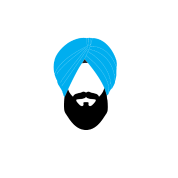
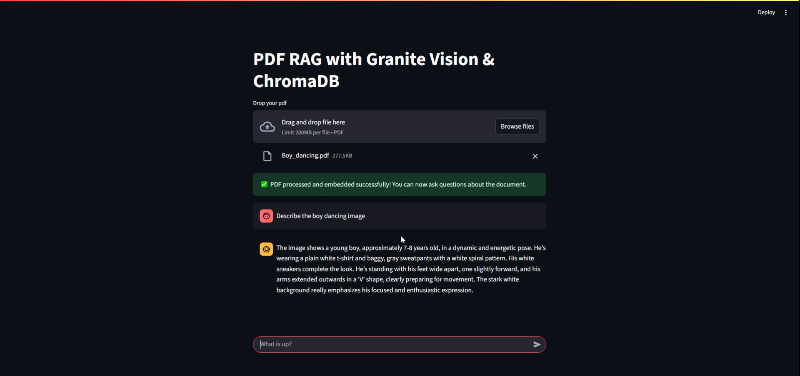
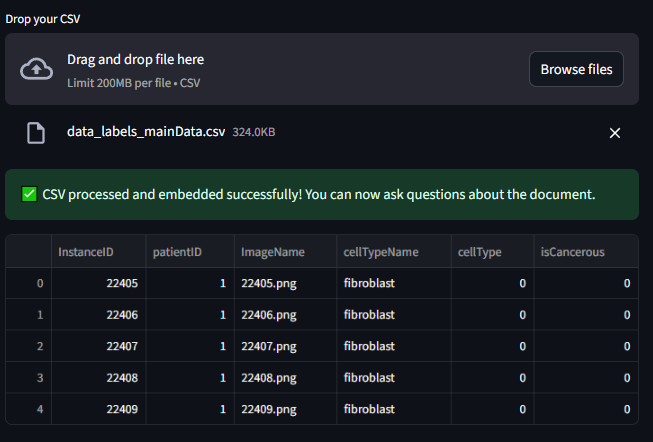
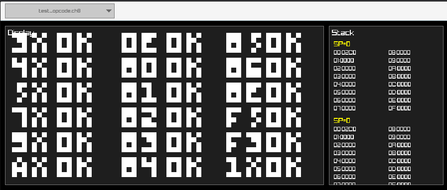

::::: {.grid .hero}

:::: {.g-col-12 .g-col-md-8 .d-flex .flex-column .justify-content-center}

<h1 class="hero-title display-1 fw-bold">Ajeet Singh</h1>
<h2 class="hero-subtitle">Building Intelligent Systems & Digital Experiences</h2>

::: {.lead .mb-4}
I am a developer passionate about **LLMs**, **Computer Vision**, and **Software**.
I turn complex data into actionable insights and build tools that bridge the gap between AI and reality.
:::

  <a href="https://www.linkedin.com/in/ajeetsingh6" class="btn-social" target="_blank"><i class="bi bi-linkedin"></i> LinkedIn</a>
  <a href="https://github.com/Ajeets6" class="btn-social" target="_blank"><i class="bi bi-github"></i> Github</a>
  <a href="mailto:your.email@example.com" class="btn-social"><i class="bi bi-envelope"></i> Contact</a>

::::

:::: {.g-col-12 .g-col-md-4}

::: {.profile-img-container}

:::

::::

:::::

::::: {.column-page-inset}

<h2 class="section-heading">Technical Arsenal</h2>

:::: {.skills-grid}

::: {.skill-category .accent-blue}

<i class="bi bi-cpu"></i>

<h3 class="category-title">Core Tech</h3>

Python
C++
Rust
JavaScript

:::

::: {.skill-category .accent-purple}

<i class="bi bi-robot"></i>

<h3 class="category-title">AI & ML</h3>

PyTorch
TensorFlow
LLMs / RAG
Computer Vision
HuggingFace

:::

::: {.skill-category .accent-orange}

<i class="bi bi-window-stack"></i>

<h3 class="category-title">Development</h3>

Docker
Kubernetes
FastAPI
React
Git

:::

::: {.skill-category .accent-green}

<i class="bi bi-bar-chart-fill"></i>

<h3 class="category-title">Data Science</h3>

Pandas
NumPy
Scikit-learn
Visualization

:::

::::

<h2 class="section-heading">Selected Projects</h2>

:::: {.project-grid}

::: {.project-card .position-relative}
::: {.project-img-container}

:::
::: {.project-content}
[Multimodal Chatbot](posts/multi-modal-rag/rag.md){.stretched-link .text-decoration-none .h3 .d-block .fw-bold}

::: {.project-desc}
PDF Chatbot with local LLMs, extracting text and images for context-aware answers.
:::
:::
:::

::: {.project-card .position-relative}
::: {.project-img-container}

:::
::: {.project-content}
[DashboardLLM](posts/dashboard-llm/dash.md){.stretched-link .text-decoration-none .h3 .d-block .fw-bold}

::: {.project-desc}
Generates interactive charts from CSV data using LLMs and Vega-Lite.
:::
:::
:::

::: {.project-card .position-relative}
::: {.project-img-container}

:::
::: {.project-content}
[CHIP-8 Emulator](posts/chip8-raylib/chip8.qmd){.stretched-link .text-decoration-none .h3 .d-block .fw-bold}

::: {.project-desc}
CHIP-8 emulator built with Raylib and compiled to WebAssembly for the browser.
:::
:::
:::

::::

<h2 class="section-heading">Experience</h2>

:::: {.experience-grid}

::: {.experience-card .accent-red}

<h3 class="role-title">Google Summer of Code contributor</h3>

freeBSD

May - August 2024

<ul>
<li>Implemented AArch64 and RISC-V support in QEMU’s FreeBSD user emulation, collaborating with mentor
Warner Losh.</li>
<li>Verified, debugged, and upstreamed patches addressing reviewer feedback; improved system call support
merged into QEMU main branch.</li>
<li>Contributed patches addressing reviewer feedback, improving system call support for multiple architectures</li>
</ul>

:::

::::

<h2 class="section-heading">Education</h2>

:::: {.experience-grid}

::: {.experience-card .accent-red}

<h3 class="role-title">Master of Artificial Intelligence</h3>

Royal Melbourne Institute of Technology, Australia

2024-2026

:::

::: {.experience-card .accent-pink}

<h3 class="role-title">B.Tech in Computer Science</h3>

SRM Institute of technology, India

2020 - 2024

:::

::::

:::::
