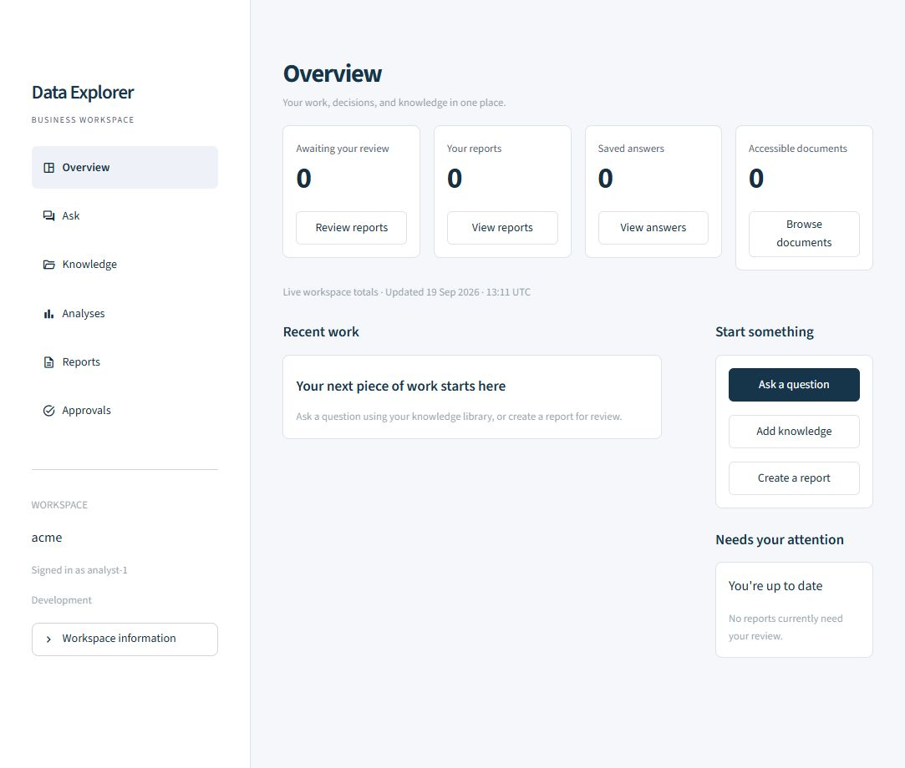

```{=html}
<div class="de-actions">
  <a class="portfolio-button primary" href="https://github.com/Ajeets6/DataExplorer">View source</a>
  <a class="portfolio-button" href="#run-locally">Run locally</a>
</div>
<figure class="de-cover">
  
  <figcaption>The DataExplorer Overview page in a fresh local development workspace.</figcaption>
</figure>
```

## From retrieval to reviewed work

An answer is only part of an enterprise AI workflow. People also need to see its sources, respect document permissions, review proposed actions, and turn useful results into shareable work.

DataExplorer brings these steps into a Python platform with a FastAPI backend and separate Streamlit workspaces for employees and administrators. It supports Ollama, OpenAI, and Anthropic, with model routing constrained by content classification.

::: {.de-highlight}
**The core design choice:** access checks happen before evidence reaches the model. Publishing and SQL execution require independent approval.
:::

## Three connected workflows

### Ask questions with evidence

Upload text or Markdown documents, explore the knowledge library, and ask questions grounded in permitted sources. Retrieval considers relevance, trust, and expiry; answers are checked for citations. Saved answers and source previews make it possible to revisit the evidence behind a response.

### Turn findings into reports

Create an artifact with source IDs for factual sections, send it for independent review, then render and download the approved result. Report revisions need a fresh decision while preserving the previous review. DOCX rendering is built in; PPTX requires a configured Node and artifact-tool runtime.

### Analyse data with approval

Text2SQL works against configured schemas available to the caller's groups. A proposed query must pass validation and independent approval before execution. The executor permits bounded, allowlisted `SELECT` queries and uses read-only transactions, tenant context, and resource limits.

## How the platform fits together

::: {.de-architecture}
::: {.de-layer}
**Workspace**

Employee pages for knowledge, answers, analyses, reports, and approvals. A separate admin console for observability.
:::
::: {.de-layer}
**API and policy**

FastAPI validates identity and coordinates retrieval, model routing, citation checks, review decisions, and execution.
:::
::: {.de-layer}
**Models and storage**

Ollama, OpenAI, or Anthropic for generation. PostgreSQL, Redis, and Qdrant support the production deployment.
:::
:::

The separation keeps the user interface focused on work while the API enforces the rules. The same backend serves the employee workspace and administrative tools.

## Engineering decisions

| Concern | Implementation |
|:--|:--|
| Identity and access | Validated JWT claims in staging and production; tenant and group checks before model access to evidence. |
| Model routing | Managed providers are limited to public/internal content. Confidential or restricted content requires an eligible private/local route. |
| Human review | Independent decisions gate artifact rendering and SQL execution. Revised reports return to review. |
| Guardrails | Injection-pattern checks, citation checks, and redaction of common PII and secrets. |
| Operational visibility | Request traces, generation trends, audit search, quality checks, and cost coverage without logging prompt or document bodies. |

The admin console distinguishes unavailable measurements from zero. Token and cost totals also separate individual attempts from request summaries, making retries and missing price information visible.

## Evaluation and deployment

The repository includes a **SEC Enterprise RAG Test Pack** combining company filings with synthetic policy and security fixtures. An offline build path supports local evaluation; live SEC downloads require an identifying user agent with an operational contact.

The test suite covers retrieval quality, guardrails, providers, Text2SQL, artifacts, workspace behavior, APIs, and deployment configuration. Docker Compose starts the API, both interfaces, and supporting services. Terraform and Cloud Build configuration target Google Cloud, including Cloud Run.

Run the test suite with `uv run pytest`. The [repository](https://github.com/Ajeets6/DataExplorer) includes the fixtures, deployment configuration, and implementation details.

## Run locally

Install **Python 3.11+**, **uv**, and **Ollama**, then start Ollama. In PowerShell:

```powershell
git clone https://github.com/Ajeets6/DataExplorer.git
cd DataExplorer
uv sync
Copy-Item .env.example .env
ollama pull llama3.1:8b
ollama pull embeddinggemma
uv run dataexplorer
```

The API runs at `http://127.0.0.1:8000`, with interactive API documentation at `/docs`. Open a second terminal in the repository to start the employee workspace:

```powershell
uv run dataexplorer-ui
```

Visit `http://127.0.0.1:8501`. The separate admin command, `uv run dataexplorer-admin`, serves port `8502` and requires the `observability-admins` or `platform-admins` group.

::: {.callout-note title="Development and production"}
Development uses in-memory defaults, so workspace records last only for the running API process. Production requires persistent services, SQL migrations, and validated JWT identity. Text/Markdown uploads are currently limited to 1 MB. See the [production setup guide](https://github.com/Ajeets6/DataExplorer/blob/master/docs/PRODUCTION_SETUP.md) for deployment and sign-in configuration.
:::

[Explore the source on GitHub](https://github.com/Ajeets6/DataExplorer){.portfolio-button}
