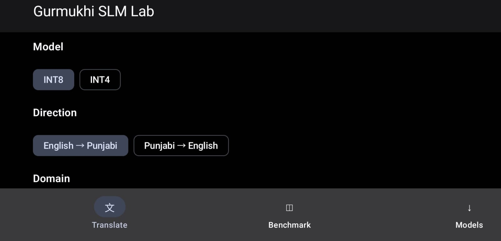
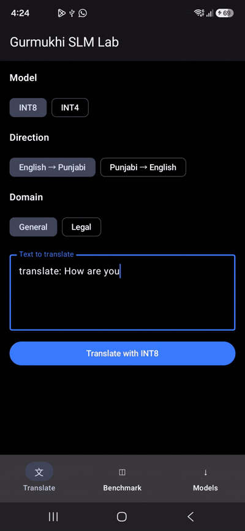

{fig-alt="Gurmukhi language model lab with translation and quantization controls"}

Gurmukhi SLM is a **58.1M-parameter, bidirectional English-Punjabi translation model** for Punjabi written in the Gurmukhi script. The project covers the complete path from corpus preparation and tokenizer training to teacher distillation, instruction fine-tuning, KV-cache ONNX export, INT8/INT4 quantization, and CPU evaluation on FLORES+.

```{=html}
<style>
main.content img.gurmukhi-demo {
  display: block;
  width: auto !important;
  height: clamp(320px, 48vw, 500px);
  max-width: 100%;
  margin-inline: auto;
  object-fit: contain;
}
</style>
```

{.gurmukhi-demo fig-alt="Gurmukhi translation interface running a model comparison"}

## Highlights

- English → Punjabi and Punjabi → English in one decoder-only model
- Shared 24,000-token bilingual BPE vocabulary
- RMSNorm, rotary position embeddings, causal self-attention, and SwiGLU
- Quality-gated sequence-level distillation from Sarvam-Translate
- Instruction fine-tuning for natural translation requests
- One ONNX interface for prompt prefill and cached token-by-token decoding
- Dynamic per-channel INT8 and genuine blockwise weight-only INT4 exports
- FLORES+ evaluation for quality, latency, throughput, and script stability

## Model Variants

| Variant | Format | KV cache | Size | Intended use |
| --- | --- | --- | ---: | --- |
| Instruction fine-tuned | PyTorch FP32 checkpoint | No | 174.9 MiB | Continued training and research |
| Cached FP32 | ONNX | FP32 | 222.6 MiB | Reference cached inference |
| **Cached INT8** | ONNX, dynamic per-channel QInt8 weights | FP32 | **56.63 MiB** | Fast CPU inference |
| **Cached INT4** | ONNX, symmetric blockwise weight-only 4-bit weights | FP32 | **35.46 MiB** | Smallest deployment model |

The generated deployment bundle contains the cached FP32, INT8, and INT4 models alongside `generation_config.json` and `tokenizer.json`. Model binaries are excluded from Git and can be reproduced with the export workflow in the [project repository](https://github.com/Ajeets6/Gurmukhi_SLM).

The project publishes Hugging Face repositories for the [base model](https://huggingface.co/Ajaple/gur-slm-decoder-base), [distilled model](https://huggingface.co/Ajaple/gur-slm-decoder-distilled-sarvam), and [instruction fine-tuned model](https://huggingface.co/Ajaple/gur-slm-decoder-instruction-finetuned). Access to non-public repositories requires authorization from their owner.

> **KV-cache precision:** “INT8” and “INT4” describe quantized learned weights. The key/value cache inputs and outputs remain FP32 in both models.

## Complete Training Pipeline

| Stage | Input | Process | Output |
| ---: | --- | --- | --- |
| 1 | Anuvaad judicial, `pan_Guru`, and `trainclean` corpora | Merge, normalize Unicode and whitespace, deduplicate, and filter noise | Clean bilingual corpus with source and domain metadata |
| 2 | Clean bilingual corpus | Train a shared 24,000-token BPE tokenizer | Bilingual vocabulary and control tokens |
| 3 | Tokenized corpus | Train encoder-decoder baseline and decoder-only student | 58.1M-parameter base checkpoint |
| 4 | Base checkpoint, gold targets, and Sarvam-Translate outputs | Quality-gate teacher outputs and perform sequence-level distillation | Distilled student |
| 5 | Distilled student and bidirectional instruction data | Instruction fine-tuning with target-only cross-entropy | Fine-tuned PyTorch checkpoint |
| 6 | Fine-tuned checkpoint | Add explicit KV-cache attention and export ONNX | Cached FP32 model |
| 7 | Cached FP32 model | Dynamic per-channel INT8 and blockwise symmetric INT4 quantization | Cached INT8 and INT4 models |
| 8 | Quantized models and FLORES+ | Measure quality, script stability, latency, and throughput | Deployment benchmark |

The stages are implemented in the repository's corpus preparation, EDA, tokenization, decoder training, distillation, fine-tuning, export, and benchmark workflows.

## Model Architecture

The exported models preserve the instruction-fine-tuned decoder architecture and add explicit per-layer key/value cache inputs and outputs.

1. The translation prompt supplies target-language, domain, and style control tokens.
2. The shared 24,000-token BPE tokenizer converts the prompt to token IDs.
3. A tied `24,000 × 512` embedding maps the IDs into the model hidden space.
4. Eight decoder blocks apply pre-norm RMSNorm, causal self-attention with RoPE, a residual connection, SwiGLU feed-forward processing, and a second residual connection.
5. Each attention layer consumes its previous key/value tensors and returns updated cache tensors.
6. Final RMSNorm and the tied language-model head produce newest-token logits.
7. Greedy decoding selects the next token and repeats until EOS or the generation limit.

| Property | Value |
| --- | ---: |
| Parameters | 58,139,136 |
| Vocabulary | 24,000 |
| Context length | 256 tokens |
| Decoder layers | 8 |
| Hidden size | 512 |
| Attention heads | 8 |
| Head dimension | 64 |
| Feed-forward size | 2,048 |
| Positional encoding | RoPE, base 10,000 |
| Normalization | Pre-norm RMSNorm |
| Feed-forward activation | SwiGLU / SiLU gate |
| Embedding/output weights | Tied |

### KV-Cache Inference

| Step | Application | Tokenizer | Cached ONNX model |
| ---: | --- | --- | --- |
| 1 | Format the complete translation prompt | Encode it as `input_ids [1, prompt_length]` | — |
| 2 | Send the prompt IDs and 16 zero-length FP32 caches | — | Prefill the prompt and return newest-token logits plus 16 present caches |
| 3 | Select the next token | — | — |
| 4 | Send one token with the previous layer caches | — | Return newest-token logits and extended caches |
| 5 | Repeat steps 3–4 until EOS or `max_new_tokens` | — | Reuse the cached prefix without recomputing it |
| 6 | Send the generated token IDs for decoding | Convert IDs to text | — |

There are two cache tensors—key and value—for each of the eight layers. Each tensor has shape `[1, 8, sequence_length, 64]`. Prefill consumes the full prompt with empty caches; subsequent calls consume one token and reuse the returned caches, avoiding recomputation of the complete prefix.

## Data and Tokenization

| Source | Domain | Sentence pairs |
| --- | --- | ---: |
| `judicial` | Legal | 1,261,948 |
| `pan_Guru` | General | 85,907 |
| `trainclean` | General | 255,705 |
| **Total** |  | **1,603,560** |

The judicial subset comes from the [Anuvaad Parallel Corpus](https://github.com/project-anuvaad/anuvaad-parallel-corpus). Before cleaning, the combined data contains 2,513 exact duplicate pairs. The pipeline normalizes Unicode and whitespace, removes duplicate or invalid pairs, filters extreme lengths and source/target ratios, and retains corpus/domain provenance.

The tokenizer workflow trains one 24k BPE vocabulary for English and Gurmukhi. Its control tokens encode target language, domain, and style. The inference prompt is:

```text
<2{target}> <domain> <natural> {source text}\n
```

Examples:

```text
<2pa> <general> <natural> How are you?
<2en> <legal> <natural> ਇਹ ਸਮਝੌਤਾ ਪੰਜ ਸਾਲਾਂ ਲਈ ਲਾਗੂ ਰਹੇਗਾ।
```

## Distillation and Instruction Fine-Tuning

The student and teacher use different tokenizers, so the project uses quality-gated **sequence-level knowledge distillation**, not token-aligned KL divergence. Teacher translations are rejected when they show script errors, English leakage, implausible length ratios, or invalid output, and accepted targets are mixed with gold corpus targets.

The distilled model is then trained in both translation directions using wrappers such as `translate:`, `Translate:`, `Translate this:`, and `Translate only this:`. The saved checkpoint records:

| Fine-tuning field | Value |
| --- | ---: |
| Optimizer steps | 2,001 |
| Augmented training examples | 186,832 |
| Initial validation loss | 1.1610 |
| Final validation loss | 0.7909 |
| Objective | Target-only cross-entropy |

## INT8 and INT4 Export

The export workflow reconstructs the trained model with cache-aware attention and produces one ONNX graph that supports both prefill and decode.

- **INT8:** ONNX Runtime dynamic quantization, signed QInt8, per-channel weights.
- **INT4:** ONNX Runtime `MatMulNBits`, symmetric weight-only quantization, 32-value blocks, QOperator format, and quantized `MatMul`/`Gather` constants.
- **Unquantized state:** activations and KV caches remain FP32.
- **Generation contract:** greedy decoding, up to 96 new tokens by default.

The FP32 source graph is exported at opset 20. ONNX Runtime upgrades the native INT4 graph to opset 21.

## FLORES+ Results

The following results come from 900 aligned rows of the local FLORES+ `dev` split, six ONNX Runtime CPU threads, greedy decoding, and a 96-token generation limit. Latency is hardware-dependent; the quality scores are the more useful model comparison, and performance should be rerun on the intended deployment device.

| Model | Direction | BLEU | chrF++ | Script error | First token | Mean latency | Throughput |
| --- | --- | ---: | ---: | ---: | ---: | ---: | ---: |
| INT8 | English → Punjabi | 22.15 | 46.27 | 0.00% | 5.14 ms | 70.99 ms | 436.45 tok/s |
| INT8 | Punjabi → English | 23.34 | 50.79 | 0.00% | 5.33 ms | 72.84 ms | 431.52 tok/s |
| INT4 | English → Punjabi | 22.91 | 46.95 | 0.00% | 7.19 ms | 51.32 ms | 598.88 tok/s |
| INT4 | Punjabi → English | 24.39 | 51.16 | 0.22% | 7.53 ms | 53.82 ms | 583.13 tok/s |

The machine-readable benchmark summary and reproduction commands are available in the [Gurmukhi SLM repository](https://github.com/Ajeets6/Gurmukhi_SLM).

## Limitations and Next Steps

- The model is specialized for English-Punjabi translation, not general-purpose chat.
- The 256-token context limits long-document translation.
- FLORES+ results should be extended to the complete `dev` and `devtest` sets before broad generalization claims.
- INT4 kernel performance depends on ONNX Runtime, CPU instruction support, and the target device.
- Mobile validation should measure peak memory, startup time, thermal behavior, and sustained tokens per second on real hardware.

The original online data-analysis notebook is available on [marimo molab](https://molab.marimo.io/notebooks/nb_7UA5TaVaoCqvAZ16d93KKL).

## Data License


The corpus work is licensed under a [Creative Commons Attribution 4.0 International License][cc-by]. Individual source datasets, model checkpoints, and teacher models retain their own licenses and terms; review them before redistributing derived artifacts.

[cc-by]: https://creativecommons.org/licenses/by/4.0/
[cc-by-shield]: https://img.shields.io/badge/License-CC%20BY%204.0-lightgrey.svg
