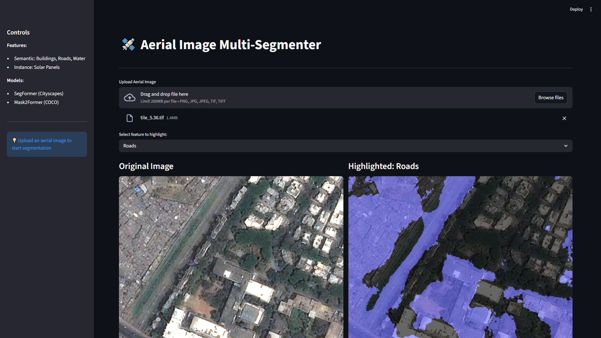

Aerial AI identifies structures and land features in aerial imagery. It combines semantic segmentation for buildings, roads, and water with instance segmentation for individual solar panels, then exposes both tasks through a Streamlit inference interface.

## Datasets

- **Aerial Segmentation (Kaggle):** RGB aerial images and class masks for semantic segmentation
- **Solar Plants Brazil:** TIFF imagery and binary masks for solar-panel instances
- **Indian demo set:** Sample aerial TIFF images used for testing and inference

## Models

- **Semantic segmentation:** SegFormer, initialised from `nvidia/segformer-b1-finetuned-cityscapes-1024-1024`
- **Instance segmentation:** Mask2Former, initialised from `facebook/mask2former-swin-base-coco-instance`

The best fine-tuned checkpoints are stored in `output/semantic/best_model` and `output/instance/best_model`.

## Workflow

1. Preparation scripts download and organise the data into training and validation sets.
2. `train_semantic.py` fine-tunes SegFormer for buildings, roads, and water.
3. `train_instance.py` fine-tunes Mask2Former for solar-panel instances.
4. `app.py` loads the selected checkpoint and runs inference.
5. Streamlit displays the segmentation overlay and summary statistics.

## Inference Interface

{fig-alt="Aerial AI interface comparing satellite imagery with a semantic segmentation result"}

## Demo

<video controls width="100%" poster="aerial.png">
   <source src="aerial.mp4" type="video/mp4">
   Your browser does not support embedded video. <a href="aerial.mp4">Download the demo video.</a>
</video>

## Train the Models

```bash
# Train both models on Windows
train_all.bat

# Or train individually
python train_semantic.py --train_image_dir ./data/aerial_segmentation/train/images --train_mask_dir ./data/aerial_segmentation/train/masks --val_image_dir ./data/aerial_segmentation/val/images --val_mask_dir ./data/aerial_segmentation/val/masks
python train_instance.py --train_image_dir ./data/solar_panels/train/images --train_mask_dir ./data/solar_panels/train/masks --val_image_dir ./data/solar_panels/val/images --val_mask_dir ./data/solar_panels/val/masks
```

## Run the Interface

```bash
streamlit run app.py
```

Source code: [aerial_AI](https://github.com/Ajeets6/aerial_AI)
