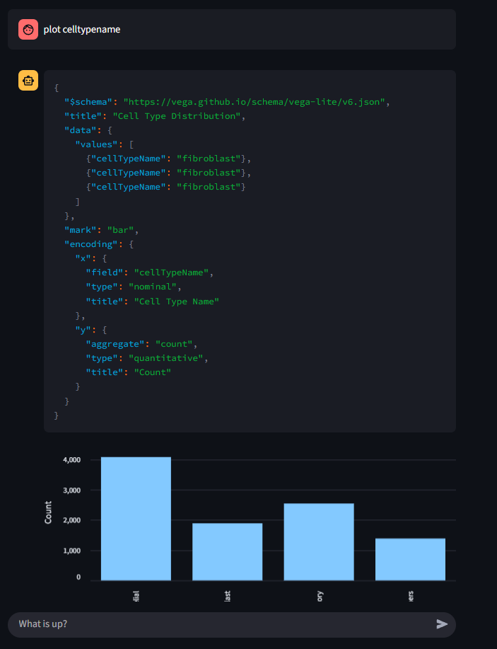

DashboardLLM turns natural-language questions about CSV data into interactive charts. Instead of generating executable plotting code, the model produces declarative Vega-Lite specifications that the application validates and renders in Streamlit.


{fig-alt="DashboardLLM interface showing an uploaded CSV dataset"}


{fig-alt="DashboardLLM interface showing generated charts and analysis controls"}

## What It Does

- **Profiles uploaded data:** Reads CSV files with Pandas and prepares their structure for analysis.
- **Generates interactive charts:** Produces Vega-Lite JSON specifications from natural-language requests.
- **Retrieves relevant context:** Uses ChromaDB to find the data chunks most useful for each question.
- **Runs models locally:** Serves generation and embedding models through Ollama.

## Tech Stack

- **Backend and orchestration:** Python, LangChain
- **Interface:** Streamlit
- **Model serving:** Ollama
- **Generation:** Qwen or another compatible chat model
- **Embeddings:** `granite-embedding:latest`
- **Vector database:** ChromaDB
- **Data processing:** Pandas

## How It Works

1. The user uploads a CSV file.
2. Pandas reads the data and the application indexes relevant context in ChromaDB.
3. The user describes the chart or analysis they need.
4. The language model returns a Vega-Lite specification grounded in the uploaded data.
5. Streamlit renders the chart and keeps the conversation available for follow-up questions.

## Getting Started

1. Clone the repository:
```bash
git clone https://github.com/Ajeets6/dashboard-LLM.git
cd dashboard-LLM
```

2. Install dependencies:
```bash
pip install -r requirements.txt
```

3. Run the application:
```bash
streamlit run main.py
```

4. Upload a CSV file and ask for a chart or analysis.

## Security

DashboardLLM reduces the risks associated with model-generated plotting code by using declarative Vega-Lite JSON rather than executing arbitrary Python. Local model serving also keeps the model runtime under the user's control. Uploaded data should still be handled according to the security requirements of the environment in which the application is deployed.

Source code: [dashboard-LLM](https://github.com/Ajeets6/dashboard-LLM)
