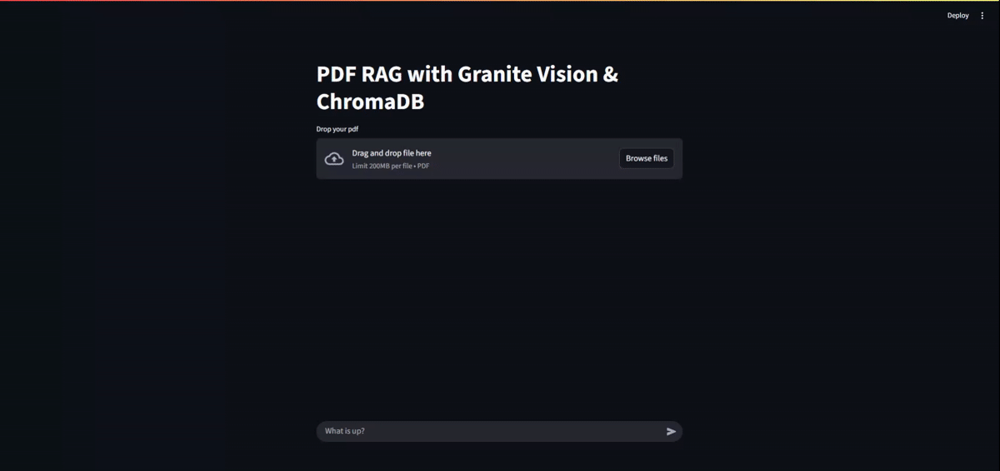

This local RAG application answers questions about uploaded PDFs by retrieving evidence from both written content and embedded images. It combines text extraction, image descriptions, vector search, and a locally served language model in a Streamlit chat interface.

{fig-alt="Multimodal PDF RAG interface processing and answering questions about an uploaded document"}


## What It Does

- **Processes text and images:** Extracts both content types from each PDF.
- **Makes images searchable:** Uses a local vision model to turn visual content into semantic descriptions.
- **Retrieves relevant evidence:** Stores text chunks and image descriptions in ChromaDB for similarity search.
- **Runs models locally:** Uses Ollama to keep model serving and document processing under the user's control.
- **Supports conversational queries:** Streams grounded answers through a Streamlit chat interface.

## Tech Stack

- **Backend and orchestration:** Python, LangChain
- **Interface:** Streamlit
- **Model serving:** Ollama
- **Generation and vision:** `gemma3:latest` by default, with support for other compatible local models
- **Embeddings:** `granite-embedding:latest`
- **Vector database:** ChromaDB
- **PDF processing:** PyMuPDF (`fitz`)

## How It Works

The application uses a two-stage pipeline.

### Document ingestion

1. PyMuPDF extracts text and images from each page.
2. A local vision model generates a text description for every extracted image.
3. The application splits the text and image descriptions into manageable chunks.
4. An embedding model converts each chunk into a vector, which is stored in ChromaDB.

### Retrieval and answer generation

1. The embedding model converts the user's question into a query vector.
2. ChromaDB returns the most relevant text chunks and image descriptions.
3. The application combines the retrieved evidence with the original question.
4. The generation model produces an answer grounded in that context.
5. Streamlit displays the answer as it is generated.

## Setup and Installation

1. Clone the repository:

```bash
git clone https://github.com/Ajeets6/multi-modal-RAG.git
cd multi-modal-RAG
```

2. Install the Python dependencies:
```bash
pip install -r requirements.txt
```

3. Install Ollama, then pull the required models:
```bash
ollama pull gemma3:latest
ollama pull granite-embedding:latest
```

4. Make sure Ollama is running.

## Usage

Start the Streamlit application:

```bash
streamlit run src/main.py
```

Source code: [multi-modal-RAG](https://github.com/Ajeets6/multi-modal-RAG)
